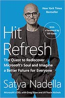

The son of an Indian Civil servant studies hard, gets an engineering degree, immigrates to the United States, and makes it in tech. But wait, there is more to it. Hit Refresh is less about the personal life of Satya and more about the amazing transformation happening inside Microsoft. This is my informal summary of Hit Refresh, an autobiography of Satya Nadella.

I am usually sceptical to read biographies and autobiographies, to avoid the inherent narrative biases and survivor biases that come with them. As with many other autobiographies, there are examples of these biases in this book. However, the main reason I picked this book is to understand Microsoft’s makeover under Satya Nadella and the book does a great job of explaining that. It gives a fascinating account of Microsoft’s a journey towards the Cloud and provides his unique perspective on empathy, which is much different than the nowadays overly misused corporate buzzword.

Satya became the CEO when Microsoft was struggling, trying to catch up with Google(search), Apple(smartphones) and Amazon(cloud). Windows PC and Phone markets were shrinking, employees were leaving and developers were frustrated. Within 3 years, he was able to transform Microsoft’s culture 180 degrees, establish Microsoft as a leader in Cloud Computing, and change its perception among the developers(open-sourcing of dotnet). Microsoft has embarked on a major transition toward becoming a cloud computing giant through Azure. Shares of Microsoft have more than doubled since he became CEO. Hit Refresh does a good job of describing this ongoing journey. He says in the book that he wanted to share these experiences in real time rather than looking back on them years later. I think this makes the book a much more interesting read as we can see the changes happening in Microsoft as they do happen.

The book follows three distinct storylines. First, he shares his own transformation from India to the United States. Second, it focuses on the transformation of Microsoft under his leadership. Lastly, it explores the future of Cloud Computing, Artificial Intelligence, and Machine Learning.

The first chapter gives a brief overview of his childhood in Hyderabad and journey to the States. It describes how his parents and Cricket influenced him and shaped his worldview. He also shares the personal story of his son Zain, who was left with cerebral palsy after suffering asphyxia in utero. He writes about how his wife taught him to face reality, help develop empathy and expand his focus from pitying himself towards taking care of their son.

Next few chapters explain the shift towards cloud from the typical enterprise software Microsoft is known for. I love the analogy of **Seeing the Cloud through the Windows.** He does explain the basics of distributed and cloud computing in simpler terms, which is nice. A brief summary of how Azure evolved from a secret project named Red Dog to the Cloud giant it is today is also very interesting. This really fascinated me because it involved not only technological innovations but also genius business strategies. The book doesn’t provide too many details about the new commercial model that Takeshi Numoto developed to measure consumption of cloud services and new ways to package the products for the customers. It would have been an interesting read.

For the final part of the book, the focus shifts to the future of technology. It explores Mixed Reality, Artificial Intelligence and Quantum Computing. It is interesting to see Satya’s thoughts on this classic Explore-Exploit problem. Should Microsoft continue enjoying their success, or explore something they are not sure about and pursue new opportunities? He briefly details Microsoft’s strategy for solving this puzzle.

Something I would have loved to read more in the book was the failed Nokia deal and how he handled it, and the thinking that went behind acquiring LinkedIn. Overall, it does a good job of bridging technology with business and provide a coherent narrative. I think the book is targeted towards Microsoft employees, customers and partners. It’s also a good read for aspiring/current Computer Science and Business students.

To conclude, it is all about how people and organizations can and must hit refresh from time to time. I definitely am convinced that Microsoft I grew up with in the late 2000s has definitely changed since Satya became the CEO.