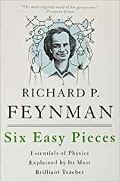

A really good introductory book to big ideas in Physics, by Richard Feynman. It is very approachable, and can be read by a high-school student as well as someone doing a PhD. He explains some really advanced concepts by relating them to everyday objects and events in life. The book literally changes the way you look at the world.

  

**Atoms in Motion**

In this chapter, Feynman describes the atomic theory. Some examples: What happens when you boil water, how does it evaporate. How the size of the atoms relate to regular objects, how the heat is transferred from coffee to cup to floor by jiggling of atoms, etc. It’s very interesting, and can change how you look at everyday objects.

**Basic Physics**

This chapter tries to examine the most fundamental ideas we have about Physics. It’s a very philosophical chapter and a good introduction to scientific thinking. It dives into heat, electricity, mechanics, magnetism, properties of substances, light/optics, nuclear physics, gravity, etc. Short introduction to quantum physics is also provided.

**The Relation of Physics to Other Sciences**

Physics is the most fundamental and all-inclusive of the sciences, and has had a profound effect on all scientific development. Feynman calls Physics “Natural Philosophy” and describes how Physics is related to Chemistry, Biology, Geology, Psychology, etc.

**Conservation of Energy**

This chapter very intuitively explains this fundamental law, and how and why it works. I loved the example of Dennis the Menace and his building blocks. It also explains different types of energy, e.g. Potential, Kinetic, Heat, Elastic, etc. and how they relate to each other.

**The Theory of Gravitation**

Feynman explains the law of gravitation, and how to objects attract each other based on the mass of each and distance between them. It explains how and why planets revolve around each other. The reasoning behind stars are formed is fascinating. Another topic deserving discussion is Einstein’s modification of Newton’s law of gravitation and the theory of relativity.

**Quantam Behavior**

The final chapter explains the quantum behavior, i.e. the behavior of matter on an atomic scale. Things on a very small scale behave very differently. There are a handful of experiments provided for better understanding, such as experiment with bullets, with waves, with electrons, and so on. A brief introduction to Heisenberg’s uncertainty principle is provided, which states that we cannot determine the exact speed and the exact location of any object at the same time.