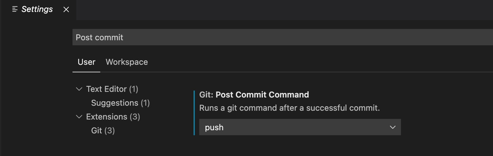

If you are a solo developer working on a project, and need to push your changes immediately after committing them to the repository, Visual Studio Code has a shortcut that will make your life easier. 

Open the settings (cmd + comma), and type 'Post commit'. You will see the **Git: Post Commit Command**. Now select **Push** from the dropdown. Now VS Code will automatically push your code to the remote repository whenever you commit your changes.

I find this highly useful when working on this blog, which is a static site hosted by GitHub Pages. I will add a post in Typora, which is my favorite Markdown editor, go to VS Code, and commit my changes, and it will take care of the rest. When combined with the keyboard shortcut (cmd + Enter) VS Code provides to commit the changes, deploying site is matter of typing a message and pressing couple of keys.

Blogging has never been this simpler!

  

