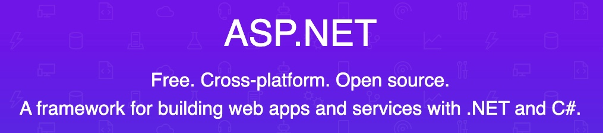
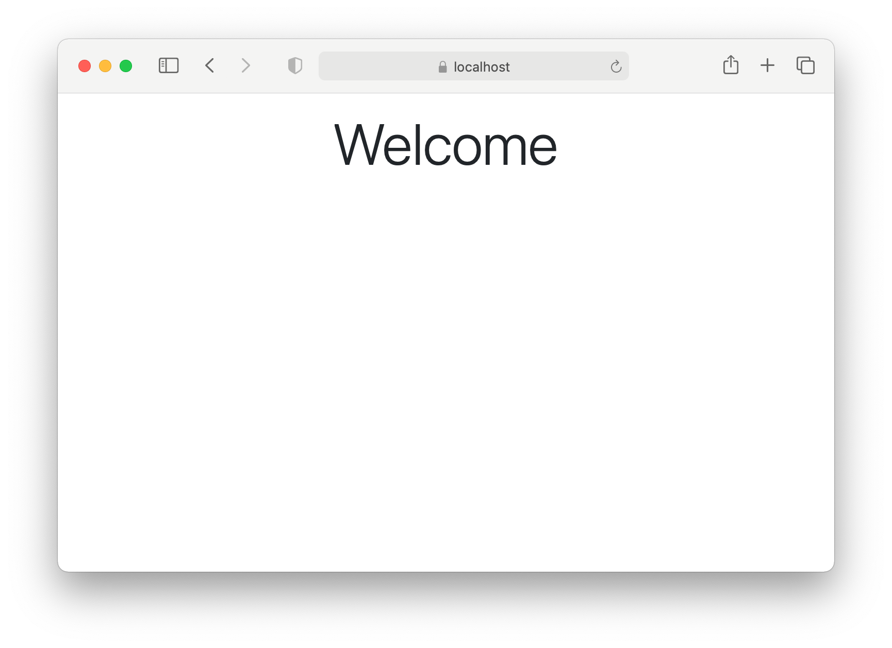

In this article, we will look at how to get started with your first [ASP.NET Core](https://dotnet.microsoft.com/apps/aspnet) application. We will install the .NET framework, then use one of the generators to quickly get our application up and running in the browser. The whole process shouldn't take more than ten minutes. 

<div class="random centered">
  <a target="_blank" href="../images/random/aspnetcore_banner.jpg">
    
  </a>
</div>

ASP.NET Core is a **cross-platform, high-performance, open-source** web application framework from Microsoft. It enables developers to build **modern, cloud-enabled** web applications. 

- **Cross-Platform**: The main advantage of ASP.NET Core is that it’s not tied to a Windows operating system, like the legacy ASP.NET framework. You can develop and run production-ready ASP.NET Core apps on Linux or a Mac. 
- **High Performance**: It’s also designed from scratch, keeping performance in mind. It’s now one of the fastest web application frameworks. 
- **Open Source**: Finally, it’s open-source and actively contributed by thousands of developers all over the world. 

Both the ASP.NET and ASP.NET Core run on `C#` programming language, an object-oriented, general-purpose programming language. If you haven't programmed in `C#` before, a good book to start with is [Essential C#](https://www.amazon.com/Essential-6-0-Addison-Wesley-Microsoft-Technology-ebook/dp/B015NB7V7A/ref=sr_1_7?dchild=1&keywords=essential+c%23&qid=1609510214&sr=8-7), by Eric Lippert.

ASP.NET Core follows the [convention-over-configuration](https://rubyonrails.org/doctrine/#convention-over-configuration) paradigm to build web applications. It was invented and popularized by the Ruby on Rails framework <sup>[1]</sup>. A framework that follows this approach uses sensible defaults to reduce or eliminate the repetitive decisions that developers have to make while building applications. 

As rails [doctrine](https://rubyonrails.org/doctrine/) says,

> ... by giving up vain individuality, you can leapfrog the toils of mundane decisions, and make faster progress in areas that really matter.

That's enough for a quick background. Now let's get our hands dirty. Before you begin with ASP.NET, you need to install the .NET software development kit (SDK) using the following link.

[Download .NET SDK](https://dotnet.microsoft.com/learn/aspnet/hello-world-tutorial/install)

To check if everything is installed correctly, open a new terminal window and run the following command:

```
$ dotnet --version
```

If the installation was successful, the program should report its version, e.g. `5.0.100`.

### Create your App

Now that you have installed the framework, you will create a simple blog, similar to the blog you are reading this tutorial on. Now, .NET comes with several pre-configured generators designed to make the developer's life easier by creating everything necessary to start working on a project.

To see all the available generators, run the `dotnet new` command in a terminal. You should see the following output.

```bash
$  ~ dotnet new

Templates                             Short Name               Language          Tags
--------------------------------      -------------------      ------------      ----------------------
Console Application                   console                  [C#], F#, VB      Common/Console
Class library                         classlib                 [C#], F#, VB      Common/Library
ASP.NET Core Empty                    web                      [C#], F#          Web/Empty
ASP.NET Core Web App (Model-V...      mvc                      [C#], F#          Web/MVC

... and much more
```

This tutorial focuses on using ASP.NET to build a web application that uses the **Model-View-Controller (MVC)** pattern, which we will learn about later in a future post. We will use the MVC generator to scaffold a complete web application using the following command. 

```bash
$ dotnet new mvc -o blog
```

This creates an ASP.NET MVC application called blog in a blog directory. The `-o` parameter creates a directory named blog where your app is stored. You can see all the command-line options that the dotnet new command has by running 

```bash
$ dotnet new --help
```

After your blog application is scaffolded, switch to the directory. 

```bash
$ cd blog
```

This directory contains the files and folders that make up a complete ASP.NET application. We will take a look at the application structure in a future tutorial.

### Run your app

Let's get something up and running on the browser. In the terminal, run the `dotnet run` command, which first restores all the dependencies, builds the project and finally runs the application. 

```bash
$ dotnet run

Building...
info: Microsoft.Hosting.Lifetime[0]
      Now listening on: https://localhost:5001
info: Microsoft.Hosting.Lifetime[0]
      Now listening on: http://localhost:5000
info: Microsoft.Hosting.Lifetime[0]
      Application started. Press Ctrl+C to shut down.
info: Microsoft.Hosting.Lifetime[0]
      Hosting environment: Development
info: Microsoft.Hosting.Lifetime[0]
      Content root path: /tutorial/blog
```

To see your application in action, open a new browser window and go to [https://localhost:5001](https://localhost:5001/). You should see the default ASP.NET welcome page.

<div class="random centered">
  <a target="_blank" href="../images/random/welcome.png">
    
  </a>
  <div class="caption">Welcome Page</div>
</div>

Note: By default, the HTML for the above web page is stored in the `Layout` file, under the `View` folder. To keep things simple for future tutorials, I have removed the default header and footer, and the default style so we can start from a blank canvas.

If you want to stop the application, type `Ctrl+C` in the terminal window.

**Congratulations, you have just created and launched your first ASP.NET web application successfully.**

In the next post, we will learn how the MVC pattern, which forms the core of the ASP.NET framework, works.

---

<small>[1] In fact, this tutorial is inspired by [rails guides](https://guides.rubyonrails.org/). When I started learning ASP.NET, I wished there were guides similar to rails, but I couldn't find one. Hence I am writing one.</small> 

