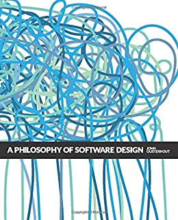
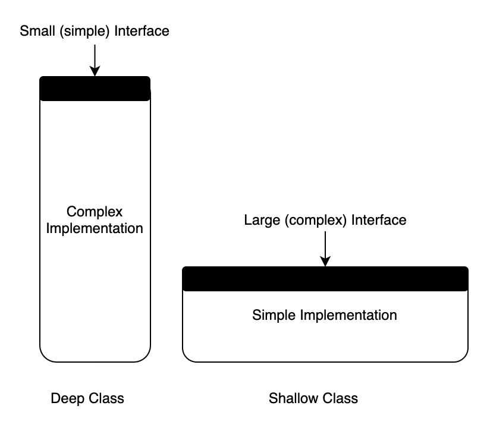

In his book, [A Philosophy of Software Design](https://www.amazon.ca/Philosophy-Software-Design-John-Ousterhout/dp/1732102201/ref=sr_1_1?dchild=1&keywords=a+philosophy+of+software+design&qid=1614756800&sr=8-1), John Ousterhout argues against the common practice of breaking large classes into smaller ones.

  
  
A Philosophy of Software Design

  

**A class typically consists of two parts, the public interface and the private implementation.**

**The interface** is everything that a developer working in a different module must know in order to use the given module. Typically, the interface describes what the module does but not how it does it.

**The implementation** consists of the code that carries out the promises made by the interface. In general, if a developer needs to know a particular piece of information in order to use a module, then that information is part of that module's interface.

  

**Shallow Classes**

A shallow class is one whose interface is complicated relative to the functionality it provides. Shallow class don’t help much in the battle against complexity, because the benefit they provide (not having to learn about how they work internally) is negated by the cost of learning and using their interfaces. Small modules tend to be shallow.

The conventional wisdom in programming is that classes should be small, not deep. We are often taught to break up larger classes into smaller ones. However, too many simple classes tend to increase the complexity of the overall system. They don’t contribute much functionality on their own, so there have to be a lot of them, each with its own interface. These interfaces accumulate to create tremendous complexity at the system level.

**Deep Classes**

**The best classes are those whose interfaces are much simpler than their implementation.** A simple interface minimizes the complexity imposed on the rest of the system. It also reduces the impact of the change in the implementation; as long as the interface doesn't change, no other modules need to know. A clearly defined interface tells exactly what developers need to know to use the module.

> The best classes are those that provide powerful functionality yet have simple interfaces.